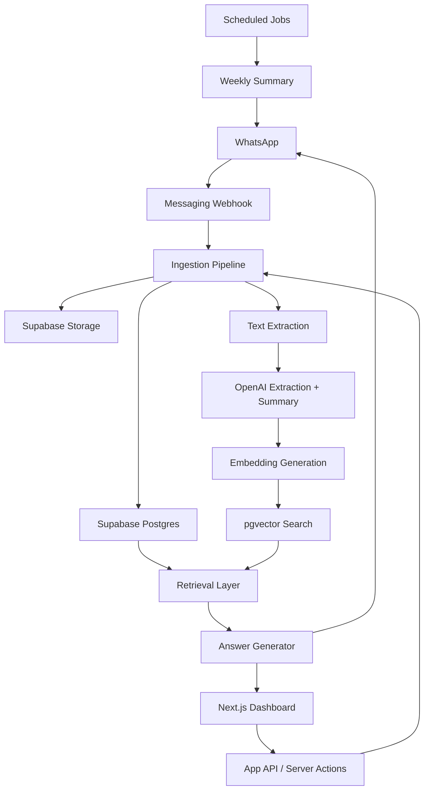

# Ayudita MVP Specification

## 1. Product Definition

Ayudita is a personal memory system for important life information. Users save documents, notes, images, voice notes, and questions through WhatsApp or a web dashboard. Ayudita extracts useful information, organizes it into structured memory, and helps users retrieve it later in natural language.

The MVP should prove one core behavior:

> A user can send Ayudita something once, then ask for it later without remembering where it was saved.

Ayudita is not primarily a chatbot or file manager. It is a trusted memory layer with conversational access.

## 2. MVP Scope

### In Scope

- User authentication
- Personal dashboard
- WhatsApp intake for text, images, PDFs, and voice notes
- Web upload for PDFs and images
- File storage
- Text extraction
- AI-generated document summaries
- Metadata extraction
- Automatic categorization
- Embeddings and semantic search
- Natural language retrieval
- Basic reminders from extracted dates
- Birthdays, anniversaries, and recurring personal dates
- Weekly summary message
- Manual review and correction of extracted data

### Out of Scope for MVP

- Multi-user family vaults
- Shared folders
- Full calendar sync
- Payment/billing integrations
- Native mobile app
- Browser extension
- Advanced document editing
- Human concierge review
- Full financial account aggregation

## 3. Primary User Flows

### Flow A: Save Through WhatsApp

1. User sends a PDF, image, screenshot, voice note, or text message.
2. Ayudita acknowledges receipt.
3. System stores the original message/file.
4. System extracts text.
5. System classifies the item.
6. System extracts structured metadata.
7. System creates embeddings.
8. System creates reminders if relevant dates are found.
9. Ayudita replies with a concise confirmation.

Example confirmation:

> Saved. This looks like an auto insurance document from GEICO. I found a policy number and a renewal date of March 14, 2027.

### Flow B: Ask Through WhatsApp

1. User asks a natural language question.
2. System classifies intent.
3. System retrieves relevant documents, facts, events, reminders, and extracted metadata.
4. System answers with citations to saved memory items.
5. If the user asks for a document, Ayudita sends the original file or a secure dashboard link.

Example:

User:

> Send me my insurance card.

Ayudita:

> I found your auto insurance card from GEICO. Sending it now.

### Flow C: Save Through Web Dashboard

1. User uploads a file.
2. Dashboard shows upload progress.
3. Processing status appears as `Processing`.
4. When complete, the item appears with category, summary, extracted fields, and reminders.
5. User can edit title, category, tags, extracted fields, and reminder dates.

### Flow D: Search Memory

1. User searches or asks a question in the dashboard.
2. System uses hybrid retrieval across documents, events, reminders, relationships, and personal facts.
3. Results show the answer, supporting items, and confidence.
4. User can open the original source.

### Flow E: Weekly Summary

1. Scheduled job runs weekly per user.
2. System gathers upcoming reminders, bills, appointments, birthdays, anniversaries, expiring documents, and recently saved items.
3. Ayudita sends a WhatsApp summary.
4. Dashboard stores the weekly summary as a memory item.

## 4. System Architecture

### Recommended MVP Stack

- Frontend: Next.js App Router
- Backend: Supabase
- Database: Supabase Postgres
- Auth: Supabase Auth
- File storage: Supabase Storage
- Vector search: Postgres with `pgvector`
- AI: OpenAI API
- Messaging: WhatsApp Business API, likely through Meta Cloud API or Twilio for faster MVP setup
- Background jobs: Supabase Edge Functions plus scheduled cron jobs
- OCR/text extraction: Cloud OCR service or document parser
- Voice transcription: OpenAI audio transcription

### High-Level Components



## 5. Core Data Model

The MVP should use a unified memory model with specialized tables for structured entities.

### `profiles`

Stores one row per user.

Fields:

- `id uuid primary key references auth.users`
- `full_name text`
- `phone_number text unique`
- `whatsapp_id text unique`
- `timezone text`
- `locale text`
- `created_at timestamptz`
- `updated_at timestamptz`

### `memory_items`

Central table for every saved thing.

Fields:

- `id uuid primary key`
- `user_id uuid references profiles(id)`
- `source_type text` - `whatsapp`, `web_upload`, `manual_note`, `system`
- `memory_type text` - `document`, `event`, `relationship`, `personal_fact`, `life_history`, `reminder`, `weekly_summary`
- `title text`
- `summary text`
- `raw_text text`
- `status text` - `uploaded`, `processing`, `ready`, `needs_review`, `failed`
- `confidence numeric`
- `occurred_at timestamptz`
- `created_at timestamptz`
- `updated_at timestamptz`

### `documents`

Stores document-specific information.

Fields:

- `id uuid primary key`
- `memory_item_id uuid references memory_items(id)`
- `user_id uuid references profiles(id)`
- `document_type text` - `insurance`, `passport`, `license`, `bill`, `receipt`, `warranty`, `medical`, `contract`, `other`
- `provider text`
- `document_number text`
- `account_number text`
- `policy_number text`
- `issue_date date`
- `expiration_date date`
- `effective_date date`
- `storage_path text`
- `mime_type text`
- `file_name text`
- `file_size bigint`
- `page_count int`
- `created_at timestamptz`

### `document_files`

Allows multiple files per memory item.

Fields:

- `id uuid primary key`
- `user_id uuid references profiles(id)`
- `memory_item_id uuid references memory_items(id)`
- `storage_bucket text`
- `storage_path text`
- `original_file_name text`
- `mime_type text`
- `file_size bigint`
- `sha256 text`
- `created_at timestamptz`

### `extracted_fields`

Stores flexible AI-extracted metadata.

Fields:

- `id uuid primary key`
- `user_id uuid references profiles(id)`
- `memory_item_id uuid references memory_items(id)`
- `field_name text`
- `field_value text`
- `field_type text` - `date`, `number`, `currency`, `identifier`, `person`, `address`, `phone`, `email`, `text`
- `confidence numeric`
- `source_quote text`
- `review_status text` - `auto`, `confirmed`, `edited`, `rejected`
- `created_at timestamptz`

### `events`

Stores dates and life events.

Fields:

- `id uuid primary key`
- `user_id uuid references profiles(id)`
- `memory_item_id uuid references memory_items(id)`
- `event_type text` - `appointment`, `birthday`, `anniversary`, `renewal`, `trip`, `due_date`, `school_event`, `medical_event`, `life_event`, `other`
- `title text`
- `description text`
- `start_at timestamptz`
- `end_at timestamptz`
- `location text`
- `is_recurring boolean`
- `recurrence_rule text`
- `person_id uuid references relationships(id)`
- `created_at timestamptz`

### `reminders`

Stores reminders generated by AI or created manually.

Fields:

- `id uuid primary key`
- `user_id uuid references profiles(id)`
- `memory_item_id uuid references memory_items(id)`
- `title text`
- `description text`
- `remind_at timestamptz`
- `due_at timestamptz`
- `status text` - `scheduled`, `sent`, `dismissed`, `completed`
- `source text` - `ai_extracted`, `manual`, `recurring`
- `created_at timestamptz`
- `updated_at timestamptz`

### `relationships`

Stores important people and organizations.

Fields:

- `id uuid primary key`
- `user_id uuid references profiles(id)`
- `memory_item_id uuid references memory_items(id)`
- `name text`
- `relationship_type text` - `family`, `doctor`, `agent`, `service_provider`, `employer`, `school`, `other`
- `organization text`
- `birthday date`
- `anniversary date`
- `phone text`
- `email text`
- `address text`
- `notes text`
- `created_at timestamptz`

### `personal_facts`

Stores remembered user facts.

Fields:

- `id uuid primary key`
- `user_id uuid references profiles(id)`
- `memory_item_id uuid references memory_items(id)`
- `fact text`
- `category text` - `health`, `preference`, `vehicle`, `family`, `home`, `work`, `other`
- `subject text`
- `confidence numeric`
- `review_status text`
- `created_at timestamptz`
- `updated_at timestamptz`

### `memory_embeddings`

Stores vector representations.

Fields:

- `id uuid primary key`
- `user_id uuid references profiles(id)`
- `memory_item_id uuid references memory_items(id)`
- `chunk_index int`
- `content text`
- `embedding vector`
- `metadata jsonb`
- `created_at timestamptz`

### `messages`

Stores WhatsApp conversation history needed for auditability and continuity.

Fields:

- `id uuid primary key`
- `user_id uuid references profiles(id)`
- `channel text` - `whatsapp`, `web`
- `direction text` - `inbound`, `outbound`
- `external_message_id text`
- `message_type text` - `text`, `image`, `document`, `audio`, `system`
- `body text`
- `media_url text`
- `memory_item_id uuid references memory_items(id)`
- `created_at timestamptz`

## 6. Storage Strategy

Use Supabase Storage with private buckets.

### Buckets

- `original-files`
- `processed-files`
- `thumbnails`
- `exports`

### Path Convention

```text
{user_id}/{memory_item_id}/original/{file_name}
{user_id}/{memory_item_id}/processed/{file_name}
{user_id}/{memory_item_id}/thumbnail/{file_name}
```

### Rules

- All files are private by default.
- Access requires authenticated user ownership.
- WhatsApp file sending should use short-lived signed URLs.
- Store the original file unchanged.
- Store derived text and previews separately.
- Use file hashes to detect duplicate uploads.

## 7. Ingestion Pipeline

### Step 1: Receive Input

Inputs may come from:

- WhatsApp webhook
- Web dashboard upload
- Manual dashboard note

Create an initial `memory_items` row with status `uploaded`.

### Step 2: Store Original

Save the file to Supabase Storage and create a `document_files` row.

### Step 3: Extract Text

Extraction strategy:

- PDF with embedded text: extract text directly.
- Scanned PDF/image/screenshot: OCR.
- Voice note: transcription.
- Text message: use message body as raw text.

Update `memory_items.raw_text`.

### Step 4: AI Classification

Classify:

- memory type
- document type
- category
- likely title
- whether reminders should be created
- whether user review is needed

### Step 5: AI Metadata Extraction

Use structured output for:

- names
- providers
- policy numbers
- account numbers
- dates
- addresses
- monetary amounts
- contacts
- personal facts
- reminders

Store flexible fields in `extracted_fields` and normalized entities in dedicated tables.

### Step 6: Summarization

Generate:

- short title
- one-sentence summary
- detailed summary
- key fields
- suggested reminders

### Step 7: Embeddings

Chunk content by semantic sections. Embed:

- title
- summary
- raw text chunks
- extracted fields
- normalized metadata

### Step 8: User Confirmation

For WhatsApp, reply with a compact confirmation.

For dashboard, show extracted data in a review panel.

## 8. Retrieval System

The retrieval layer should combine several techniques.

### Query Understanding

Classify the user query into one or more intents:

- retrieve document
- answer question
- list items
- create reminder
- save new memory
- summarize time period
- update memory

Examples:

- "Send me my insurance card" -> retrieve document
- "When does my registration expire?" -> answer question from extracted date
- "What bills are due this month?" -> list reminders/events
- "Show me documents related to my car" -> semantic + metadata search

### Retrieval Sources

Search across:

- `memory_items`
- `documents`
- `extracted_fields`
- `events`
- `reminders`
- `relationships`
- `personal_facts`
- `memory_embeddings`

### Retrieval Method

Use hybrid search:

1. Metadata filters for exact constraints.
2. Full-text search for keywords.
3. Vector search for semantic similarity.
4. Recency boosting.
5. Type boosting based on intent.

Example:

For "insurance card", boost:

- `documents.document_type = insurance`
- titles containing `insurance`
- extracted fields containing `policy_number`
- recent ready documents

### Answer Generation

The answer generator receives:

- user query
- top retrieved memory items
- extracted structured fields
- signed URLs if documents need to be sent
- safety constraints

Responses should:

- be concise
- cite the source memory item
- avoid inventing missing fields
- ask a follow-up only when needed
- offer the original file when relevant

Example:

> Your auto insurance policy expires on March 14, 2027. I found this on your GEICO auto insurance document saved on January 8.

## 9. WhatsApp UX

### First-Time Onboarding

1. User opts in through web or WhatsApp invite link.
2. Ayudita sends welcome message.
3. User confirms phone number.
4. User accepts basic terms/privacy.
5. Ayudita asks what they want to save first.

Welcome message:

> Hi, I’m Ayudita. Send me important documents, notes, screenshots, or voice notes, and I’ll help you find them later.

### Save Flow

User sends:

> Remember this.

With a file attached.

Ayudita replies:

> Got it. I’ll save and organize this.

After processing:

> Saved as "State Farm Auto Insurance Card." I found a policy number and an expiration date of August 12, 2026.

User:

> Remember that my mom's birthday is October 12.

Ayudita:

> Saved. I’ll remember your mom’s birthday is October 12. Want a reminder every year?

### Retrieval Flow

User:

> Find my passport.

Ayudita:

> I found your passport document saved on April 3. I can send the image or open it in your dashboard.

### Ambiguity Flow

User:

> Send me my insurance.

Ayudita:

> I found auto insurance and renters insurance. Which one do you want?

### Reminder Flow

Ayudita:

> Your vehicle registration appears to expire on July 30. Want me to remind you one month before?

User:

> Yes.

Ayudita:

> Done. I’ll remind you on June 30.

User:

> Remind me every year one week before Sofia's birthday.

Ayudita:

> Done. I’ll remind you every year one week before Sofia’s birthday.

### Weekly Summary Flow

Weekly message:

> Your week with Ayudita:
> - 2 bills due
> - 1 appointment coming up
> - 1 birthday this week
> - 1 document expiring soon
> - 3 new items saved last week

## 10. Dashboard UX

The dashboard should feel like a personal knowledge base, not cloud storage.

### Main Navigation

- Home
- Memory
- Documents
- Reminders
- People
- Search
- Settings

### Home

Show:

- Ask Ayudita search box
- Upcoming reminders
- Recently saved memories
- Items needing review
- Suggested actions

Primary interaction:

> Ask anything about your saved life information.

### Memory View

A unified timeline of saved memory:

- documents
- facts
- events
- reminders
- weekly summaries

Filters:

- type
- category
- date
- source
- needs review

### Documents View

Organized by life category:

- Identity
- Insurance
- Car
- Home
- Health
- Bills
- Receipts
- Warranties
- Contracts

Each document card shows:

- title
- document type
- provider
- key date
- summary
- review status
- source

### Document Detail View

Show:

- file preview
- summary
- extracted fields
- related reminders
- related people
- related documents
- original upload source
- edit/review controls

### Reminders View

Show:

- upcoming
- overdue
- completed
- generated from documents
- manually created
- birthdays and anniversaries
- recurring reminders

Allow:

- edit date
- mark complete
- dismiss
- change reminder timing
- repeat yearly, monthly, weekly, or custom

### People View

The people view should help users remember important relationship context without becoming a full contacts app.

Show:

- family members
- doctors
- insurance agents
- service providers
- important contacts

Each person can include:

- relationship to user
- birthday
- anniversary
- phone/email/address
- notes
- related documents
- related reminders
- related memories

Examples:

- "Mom's birthday is October 12"
- "Dr. Rivera is my primary care doctor"
- "Carlos is my insurance agent"
- "Sofia is allergic to peanuts"

### Search Experience

Search should support both:

- keyword search
- natural language questions

Result layout:

- direct answer at top
- supporting sources below
- related memories
- suggested next questions

### Review Queue

Items needing review appear when:

- AI confidence is low
- multiple dates could be due dates
- extracted fields conflict
- sensitive identity documents are detected

Review controls:

- confirm field
- edit field
- reject field
- merge duplicate
- set category

## 11. AI Behavior

### Extraction Prompt Contract

The extraction model should return structured JSON with:

- suggested title
- memory type
- document type
- summary
- key fields
- dates
- people/organizations
- birthdays
- anniversaries
- recurring dates
- reminders
- confidence
- review flags

### Answering Rules

Ayudita should:

- answer only from saved memory unless clearly stating general knowledge
- cite source memory items
- say when it cannot find something
- never pretend a document exists
- ask clarifying questions for ambiguous retrieval
- keep WhatsApp answers short
- provide dashboard links for deeper review

### Memory Update Rules

When the user corrects Ayudita:

> No, that policy expired last year.

The system should:

- store the correction
- update relevant extracted field review status
- preserve the original extracted value
- prefer confirmed user corrections in future answers

## 12. Security and Privacy

Ayudita stores sensitive personal data, so trust must be visible in the product.

### MVP Requirements

- Private storage buckets
- Row Level Security on every user-owned table
- Signed URLs for temporary file access
- No public document URLs
- User-controlled deletion
- Audit log for file access and AI processing
- Clear consent during onboarding
- Separate production and development environments
- Encrypted environment variables

### Recommended RLS Pattern

Every user-owned table should enforce:

```sql
auth.uid() = user_id
```

For `profiles`:

```sql
auth.uid() = id
```

### Sensitive Data Handling

- Do not send full sensitive identifiers in WhatsApp messages by default.
- Mask account numbers unless the user explicitly asks.
- Prefer dashboard links for highly sensitive documents.
- Require re-authentication for identity documents in the web app if feasible.

## 13. Background Jobs

### Jobs Needed

- Process newly uploaded items
- Retry failed extractions
- Generate embeddings
- Send reminder notifications
- Generate weekly summaries
- Expire signed URLs
- Detect duplicates

### Processing States

- `uploaded`
- `stored`
- `extracting_text`
- `classifying`
- `extracting_metadata`
- `embedding`
- `ready`
- `needs_review`
- `failed`

## 14. MVP API Surface

### Web App Routes

- `POST /api/uploads`
- `GET /api/memory`
- `GET /api/memory/:id`
- `PATCH /api/memory/:id`
- `POST /api/search`
- `GET /api/reminders`
- `PATCH /api/reminders/:id`
- `POST /api/whatsapp/webhook`

### Internal Service Functions

- `createMemoryItem`
- `storeOriginalFile`
- `extractText`
- `classifyMemoryItem`
- `extractStructuredFields`
- `createEmbeddings`
- `searchMemory`
- `answerQuestion`
- `createReminderFromExtraction`
- `sendWhatsAppMessage`
- `sendWeeklySummary`

## 15. Launch Plan

### Phase 1: Private Alpha

Goal: prove save and retrieve.

Build:

- Supabase auth
- dashboard upload
- WhatsApp webhook
- file storage
- text extraction
- AI summary/extraction
- document detail page
- natural language search

Success criteria:

- User can upload 20 personal documents.
- User can retrieve documents through natural questions.
- Extracted metadata is useful at least 80% of the time for common documents.

### Phase 2: Reminder Layer

Goal: prove Ayudita is proactive.

Build:

- extracted reminders
- reminder review
- WhatsApp reminders
- weekly summary

Success criteria:

- Users accept generated reminders.
- Weekly summary feels useful rather than noisy.

### Phase 3: Personal Knowledge Layer

Goal: expand beyond documents.

Build:

- personal facts
- relationships
- life history notes
- voice note intake
- memory timeline

Success criteria:

- Users save non-document memories.
- Users ask about life context, not only files.

## 16. MVP Success Metrics

### Activation

- User connects WhatsApp.
- User uploads or sends first memory.
- User saves at least 5 memory items.

### Retrieval

- Search success rate.
- Number of successful WhatsApp retrievals.
- Percentage of queries answered from saved memory.
- Rate of "I could not find that" responses.

### Trust

- Extraction correction rate.
- Items marked as wrong.
- Deleted item rate.
- User review completion rate.

### Retention

- Weekly active users.
- Weekly summaries opened/read.
- Repeat retrieval requests.
- New memories saved per week.

## 17. Recommended First Build

The fastest useful MVP should include:

1. Supabase schema with RLS.
2. Private file upload from dashboard.
3. WhatsApp inbound webhook.
4. Storage of original PDFs/images/audio.
5. Text extraction for PDFs/images/audio.
6. AI classification and metadata extraction.
7. Embeddings in Postgres with `pgvector`.
8. Dashboard memory list and document detail pages.
9. Search box that answers from saved memory.
10. WhatsApp retrieval for common document requests.
11. Reminder creation from extracted dates.
12. Weekly WhatsApp summary.

## 18. Key Product Principle

Ayudita should always make the user feel:

> I saved it once. Ayudita knows where it is.

Every MVP decision should support that feeling.
